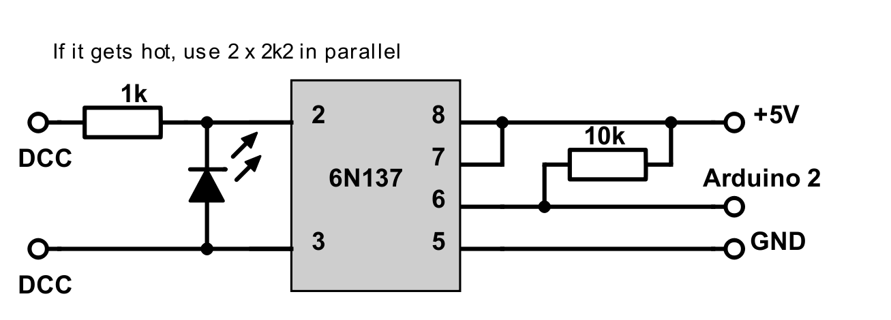
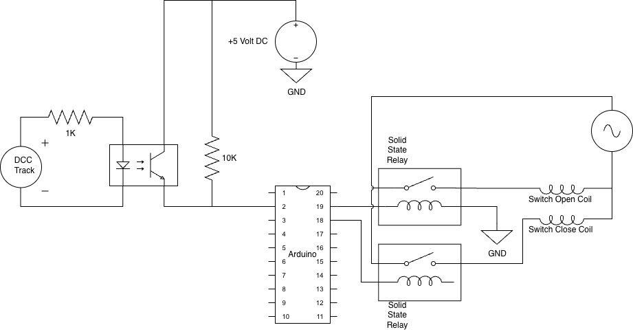

# Nmra-Decoder-Snap-Switch
 
The purpose of this project is to utilize the NMRA DCC Decoder Library to create a DCC Accessory Decoder that will control a snap switch. 

To control a snap switch, you will need the following:
- one dcc decoder address.
- DC power source to power your Arduino.
- AC power supply as the power source to throw the snap switch. Typicqlly, snap switched us approximatley 12-14 VAC. 
- Arduino Uno or Nano.
- opto isotator circuit.
- 2 single pole solid state relays.

The [DCCDecoder-MutipleSnapSwitches-Uno.ino](DCCDecoder-MutipleSnapSwitches-Uno.ino) sketch contains the configuration code for an Arduino Uno to control control multiple snap swithes. Here is a list of variables and their purpose.
- DCC_PIN: input pin that receives the DCC signal
- NUMACCESSORIES: The number of dcc decoder addresses needed. If your using one Arduino UNO to control all your switched, this should match the number of Snap switches on your layout. 
- DCCAccessoryData: This is a data structures to keep track of it's address, open pin, close pin, current directon, previous direction 
- accessory: An array of all the switches and it's DCCAccessoryData values.

To use this sketch, you will need to modify the DCC address, open pin number and close pin number for each switch. In my sample, I am controlling 11 switches. The starting dcc address is "122" with an open pine of 22 and cloe pine of 23.

The [DCCDecoder-SingleSnapSwitch-Nano.ino](DCCDecoder-SingleSnapSwitch-Nano.ino) sketch contains the configuration code for an Arduino Nano to control control a single snap switch. The varaible for this sketch are the same as the DCCDecoder-MutipleSnapSwitches-Uno.ino.

**Opto Isolator Circuit:**

This circuit is required to help prevent damage to your Arduino should something go wrong with your DCC power lines. 
This circuit is not my design, It was orrigianlly published by RudyB at Rudys Arduino Projects. For full details about using an Arduino as a dcc decoder check out [Fun with Arduino 29 DCC Accessory Decoder](https://rudysarduinoprojects.wordpress.com/2019/05/06/fun-with-arduino-29-dcc-accessory-decoder/)

**Entire Schematic:**
Pins on Arduino are only examples for schematic purpose.
